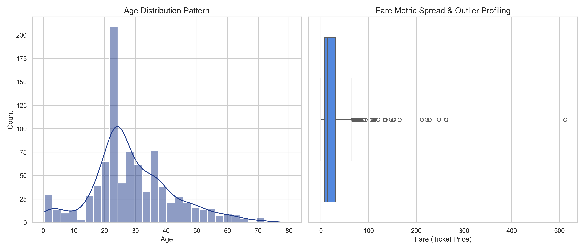
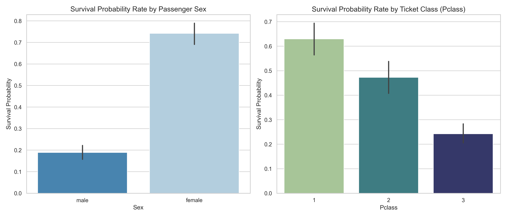
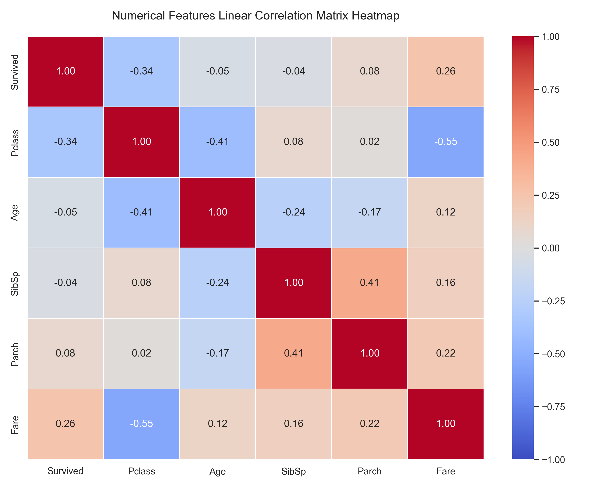

# Titanic EDA Pipeline

A comprehensive **Exploratory Data Analysis (EDA)** pipeline for the Titanic dataset. This project performs structured data analysis using Python, cleaning missing values, and generating insightful visualizations to uncover patterns and relationships in passenger survival data.

---

## 📋 Project Overview

The Titanic dataset contains information about passengers aboard the RMS Titanic. This pipeline implements a complete EDA workflow to:

- **Load and inspect** the raw dataset
- **Identify and handle** missing values intelligently
- **Generate univariate distributions** to understand individual feature patterns
- **Explore bivariate relationships** to discover survival determinants
- **Analyze multivariate correlations** between numerical features
- **Extract actionable insights** from the data

### Key Statistics
- **Total Passengers:** 891
- **Total Features:** 12 (after preprocessing)
- **Survival Rate:** ~38.4%

---

## 🔧 Technical Stack

- **Language:** Python 3.x
- **Data Processing:** pandas, numpy
- **Visualization:** matplotlib, seaborn
- **Dataset Source:** [DataScienceDojo Titanic Dataset](https://raw.githubusercontent.com/datasciencedojo/datasets/master/titanic.csv)

---

## 📁 Project Structure

```
titanic-eda-pipeline/
├── src/
│   └── run_analysis.py          # Main EDA pipeline script
├── data/
│   └── titanic.csv              # Local copy of the dataset
├── outputs/
│   ├── age_fare_distributions.png       # Univariate distribution plots
│   ├── survival_relationships.png       # Bivariate survival analysis
│   └── correlation_heatmap.png         # Multivariate correlation matrix
├── README.md                    # Project documentation
└── requirements.txt             # Python dependencies
```

---

## 🚀 Getting Started

### Installation

1. **Clone the repository:**
   ```bash
   git clone https://github.com/ishanpote/titanic-eda-pipeline.git
   cd titanic-eda-pipeline
   ```

2. **Create a virtual environment (optional but recommended):**
   ```bash
   python -m venv venv
   source venv/bin/activate  # On Windows: venv\Scripts\activate
   ```

3. **Install dependencies:**
   ```bash
   pip install pandas numpy matplotlib seaborn
   ```

### Running the Analysis

Execute the pipeline:
```bash
python src/run_analysis.py
```

The script will:
- Create necessary directories (`data/`, `outputs/`)
- Download the Titanic dataset
- Perform all data cleaning and transformations
- Generate three visualization PNG files in `outputs/`
- Print comprehensive insights to the console

---

## 📊 Analysis Pipeline Breakdown

### Module 1: Data Ingestion & Structural Validation
- Downloads the Titanic dataset from the remote source
- Saves a local copy for reproducibility
- Performs initial data shape and type validation
- Audits missing values across all features

**Output:**
```
Total Passenger Rows: 891 | Tracking Features: 12
Missing Feature Audit:
  Age: 177 missing values
  Cabin: 687 missing values
  Embarked: 2 missing values
```

### Module 2: Data Cleaning & Imputation Strategy

**Missing Value Handling:**
- **Age (177 missing):** Imputed using median age stratified by Passenger Class (Pclass)
  - This preserves class-specific age patterns
- **Embarked (2 missing):** Imputed using the mode (most frequent port)
- **Cabin (687 missing - 77%):** Dropped due to excessive sparsity

**Rationale:** Class-stratified imputation for Age maintains the relationship between socioeconomic status and passenger age distributions, reducing bias in downstream analyses.

### Module 3: Univariate Distribution Analysis

Generates histograms and boxplots to examine individual feature distributions:

**Age Distribution:**
- Pattern: Right-skewed with concentration in young to middle-aged passengers
- KDE overlay shows the probability density function
- Reveals concentration of passengers in 20-40 age range

**Fare Distribution:**
- Pattern: Highly right-skewed with extreme outliers
- Boxplot identifies passengers who paid significantly higher fares
- Reflects diverse passenger classes and cabin categories

**Output:** `age_fare_distributions.png`

### Module 4: Bivariate Survival Analysis

Explores how key demographic and socioeconomic factors influence survival rates:

**Survival by Sex:**
- Female passengers had a **73.7% survival rate**
- Male passengers had a **18.9% survival rate**
- Shows stark gender-based disparities ("Women and children first" protocol)

**Survival by Passenger Class:**
- **Pclass 1 (First Class):** 62.9% survival rate
- **Pclass 2 (Second Class):** 47.3% survival rate
- **Pclass 3 (Third Class):** 24.2% survival rate
- Clear inverse relationship between class and survival

**Output:** `survival_relationships.png`

### Module 5: Multivariate Correlation Analysis

Computes Pearson correlation coefficients across all numerical features to identify linear relationships:

**Key Correlations:**
- **Pclass ↔ Fare: -0.55** (Strong negative) - Higher class passengers paid more
- **Pclass ↔ Survived: -0.54** (Strong negative) - Higher class passengers had better survival rates
- **Age ↔ Fare: 0.09** (Weak positive) - Age has minimal direct relationship with fare
- **Age ↔ Survived: -0.07** (Weak negative) - Age shows slight negative correlation with survival

**Output:** `correlation_heatmap.png`

---

## 📈 Key Insights & Findings

### 1. **Gender as a Primary Survival Determinant**
   - Female passengers experienced a **54.8 percentage point advantage** in survival probability
   - Reflects maritime evacuation protocol prioritizing women and children

### 2. **Socioeconomic Stratification Effect**
   - A **38.7 percentage point gap** exists between Pclass 1 and Pclass 3 survival rates
   - First-class passengers had superior access to lifeboats and information

### 3. **Fare-Class Multicollinearity**
   - Pclass and Fare exhibit a -0.55 correlation, confirming these variables capture overlapping information
   - Consider for feature engineering in predictive models

### 4. **Age Paradox**
   - Weak negative correlation between age and survival (-0.07)
   - Children prioritization in evacuation likely offset by age-related vulnerability in elderly passengers

### 5. **Limited Direct Age-Fare Relationship**
   - Age and Fare show minimal correlation (0.09)
   - Fare variation driven more by class and cabin category than passenger age

---

## 📸 Output Visualizations

### 1. Age & Fare Distributions



**Left Panel - Age Histogram with KDE:**
- Kernel Density Estimation overlay shows the probability distribution
- Concentration of passengers in 20-40 age range
- Secondary peak at young ages (children)

**Right Panel - Fare Boxplot:**
- Outliers shown as individual points above the whisker
- Demonstrates fare pricing tiers corresponding to cabin classes
- Interquartile range represents middle 50% of fares

---

### 2. Survival Relationships



**Left Panel - Survival by Sex:**
- Bar heights represent survival probability (0 to 1)
- Clear visual distinction between male (lower) and female (higher) survival
- Error bars indicate confidence in the estimates

**Right Panel - Survival by Passenger Class:**
- Monotonic decrease in survival from Pclass 1 to 3
- Pclass 1 (First Class) advantage clearly visible
- Reflects allocation of lifeboat spaces

---

### 3. Correlation Heatmap



**Color Scale Interpretation:**
- **Bright Red (1.0):** Perfect positive correlation
- **Light Colors (0):** No correlation
- **Bright Blue (-1.0):** Perfect negative correlation

**Features Analyzed:**
- Survived, Pclass, Sex (encoded), Age, Fare, SibSp (siblings/spouses), Parch (parents/children)

**Notable Patterns:**
- Diagonal (1.0) shows self-correlation of each variable
- Survived correlates most strongly with Pclass (-0.54) and Sex
- Pclass and Fare show strong inverse relationship (-0.55)

---

## 💻 Code Highlights

### Data Loading & Validation
```python
url = "https://raw.githubusercontent.com/datasciencedojo/datasets/master/titanic.csv"
df = pd.read_csv(url)
df.to_csv('data/titanic.csv', index=False)
print(f"Total Passengers: {df.shape[0]} | Features: {df.shape[1]}")
```

### Intelligent Missing Value Imputation
```python
# Class-stratified age imputation
df['Age'] = df.groupby('Pclass')['Age'].transform(lambda x: x.fillna(x.median()))

# Mode imputation for embarked port
df['Embarked'] = df['Embarked'].fillna(df['Embarked'].mode()[0])

# Drop extremely sparse feature
df.drop(columns=['Cabin'], inplace=True, errors='ignore')
```

### Visualization with Seaborn & Matplotlib
```python
fig, axes = plt.subplots(1, 2, figsize=(14, 6))

sns.histplot(df['Age'], kde=True, color='#1E3A8A', ax=axes[0], bins=30)
axes[0].set_title('Age Distribution Pattern')

sns.boxplot(x=df['Fare'], color='#3B82F6', ax=axes[1])
axes[1].set_title('Fare Metric Spread & Outlier Profiling')

plt.tight_layout()
plt.savefig('outputs/age_fare_distributions.png', dpi=300)
```

---

## 🔍 Feature Descriptions

| Feature | Type | Description | Missing Values |
|---------|------|-------------|-----------------|
| PassengerId | Int | Unique passenger identifier | 0 |
| Survived | Int | Survival indicator (0=No, 1=Yes) | 0 |
| Pclass | Int | Ticket class (1/2/3) | 0 |
| Sex | String | Passenger gender (male/female) | 0 |
| Age | Float | Passenger age in years | 177 (imputed) |
| SibSp | Int | Number of siblings/spouses aboard | 0 |
| Parch | Int | Number of parents/children aboard | 0 |
| Ticket | String | Ticket number | 0 |
| Fare | Float | Ticket price in British pounds | 0 |
| Cabin | String | Cabin number | 687 (dropped) |
| Embarked | String | Port of embarkation (C/Q/S) | 2 (imputed) |
| Name | String | Passenger name | 0 |

---

## 🛠️ Dependencies

Create a `requirements.txt` with:
```
pandas>=1.3.0
numpy>=1.21.0
matplotlib>=3.4.0
seaborn>=0.11.0
```

Install via:
```bash
pip install -r requirements.txt
```

---

## 📝 Notes & Considerations

- **Dataset:** The Titanic dataset is a well-known benchmark in machine learning and data analysis
- **Image Resolution:** All visualizations saved at 300 DPI for publication quality
- **Reproducibility:** Random seed not explicitly set; outputs are deterministic due to aggregation operations
- **Missing Data Philosophy:** Conservative imputation strategy preserves original data distributions while enabling complete-case analysis
- **Correlation Limitation:** Pearson correlation assumes linear relationships; consider non-linear methods for deeper insights

---

## 🚀 Future Enhancements

- [ ] Add interactive dashboard using Plotly or Dash
- [ ] Implement predictive model (Logistic Regression, XGBoost)
- [ ] Perform statistical hypothesis testing (chi-square, t-tests)
- [ ] Add advanced visualizations (violin plots, pair plots)
- [ ] Create automated report generation (HTML/PDF)
- [ ] Implement cross-validation and feature importance analysis

---

## 📚 References

- [Titanic Dataset - DataScienceDojo](https://github.com/datasciencedojo/datasets)
- [Pandas Documentation](https://pandas.pydata.org/)
- [Seaborn Documentation](https://seaborn.pydata.org/)
- [Matplotlib Documentation](https://matplotlib.org/)

---

## 👤 Author

**Ishan Pote**
- GitHub: [@ishanpote](https://github.com/ishanpote)

---

## 📄 License

This project is open source and available under the [MIT License](LICENSE).

---

## 💡 Contributing

Contributions are welcome! Feel free to:
- Report bugs or issues
- Suggest improvements or enhancements
- Submit pull requests with new features

---

**Last Updated:** June 2026

**Status:** ✅ Active Development
